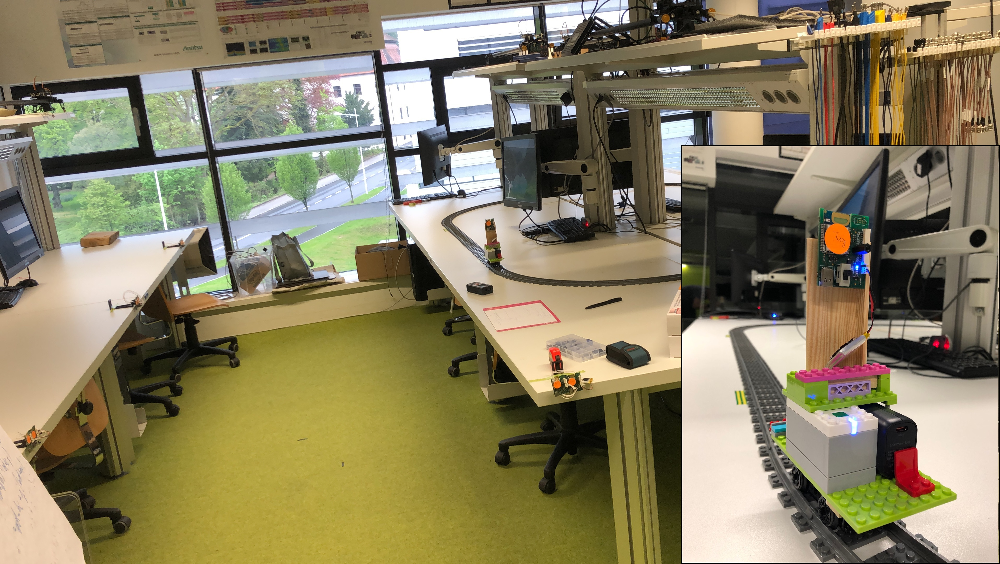

# UWB-AEC-trust-dataset
In our lab-environment we set-up 8 custom DW1000-based UWB anchors, together with one tag. The tag was mounted on the train of a model railway. The railway tracks were adjusted according to the planed trajectory using a laser range finder. A sketch of the floor plan will be added to the repo soon. 

## Check also our other papers
[Labeling for UWB Ranging in Weak NLOS Conditions](https://ieeexplore.ieee.org/document/9797024) 
[Data Trustworthiness for UWB Ranging in IoT](https://ieeexplore.ieee.org/document/10008777)

## Authors
Philipp Peterseil 
Bernhard Etzlinger 
Roya Khanzadeh 
David Märzinger 

Institute for Communications Engineering and RF-Systems 
https://www.jku.at/institut-fuer-nachrichtentechnik-und-hochfrequenzsys